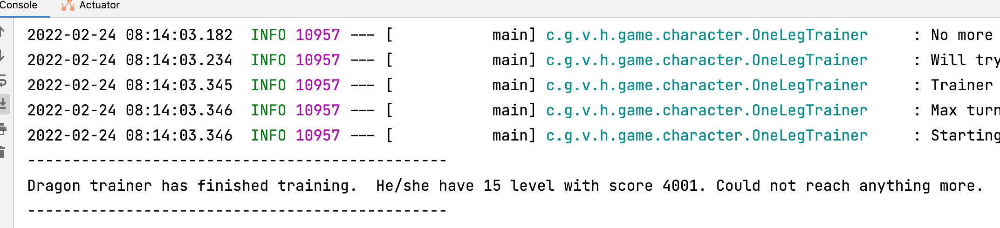

# Hiccup application

This is a simple application that try to simulate player for **Dragons of mugloar** game.
The application is named in honor of the main character from **How to train dragon** movie.

## Getting Started

Project use gradle for build and other repetitive tasks. To build project you need to execute:

```shell
./gradlew build
```

If you want to run application you can either:

```shell
./gradlew bootRun --args="-maxTurn 100"
```

or:

```shell
java -jar ./build/libs/hiccup-0.0.1-SNAPSHOT.jar -maxTurn 100
```

If you want to know what other options exist for this application:

```shell
java -jar ./build/libs/hiccup-0.0.1-SNAPSHOT.jar -help
```

Result of some random game in console:



## Configuration

It is possible to change game service url or logging level by using **application.yml** file. Just put near jar a file with content:

```yaml
hiccup:
  gameService:
    baseUrlForAPIv2: https://dragonsofmugloar.com

logging:
  level:
    root: INFO
    com:
      github:
        viktornar:
          hiccup: INFO
```

Depending on log level you can see more or less information in console. So if you specify **DEBUG** instead of **INFO** you will be able to see more details about what happening inside application. If you do not wan;t to see any infromation related to log, but only want to see end result, you can specify **NONE**

## What was used?

Under the hood I decided to use spring boot since it supports DI, web client, and it is even possible to build to native (experimental feature on spring).

I have added only basic dependencies from spring that needed to work with IoC and web client.

I have decided to use state machine. Most of the existing solution are quite big and would be too much for such kind of task. I decided to implement some kind of state machine in RxJava (wanted to try this awesome library). At the end I have quite flexible state machine with possibility to redefine default flow on transition stage. At the end it seems that solution is also too complicated, but at least it is not difficult to test all flow.

For data mapping from one data (reward, basket, game) class into another (trainer context) I'm using map struct. This library let to simply such data flow between data classes.

At the end I was able to reach level 15 with around 3810 score in best case. On average I'm always able to reach level 15 with around 2500 score, but I believe that it can be improved, but I need to know what kind of logic is under the hood in game engine.

## What was wrong?

State machine? It seems that mys solution is not so good as I thought at start. Api of state machine that was created is complicated and not clear. It is also have a bug. Stack overflow occur if we have more than 180 turns. Do not figure out have to dispose correctly events in subject.

It would be interesting to implement decision tree for solving this game, but I have a limited amount of time and will leave this maybe (repeat again, maybe :D) in the future.

## Development

I'm using unit tests,  check style and sonar to ensure code quality.

To run tests:

```shell
./gradlew test # you can run ./gradlew check as well
```

To run checkstyle:

```shell
./gradlew checkstykeMain
```

To run sonar:

```shell
docker-compose up -d -f ./src/main/docker/sonar.yml
./gradlew sonarqube
```

Of course, you can just import project in IntelliJ IDEA and use UI to start mentioned gradle task earlier.

## Reference Documentation
For further reference, please consider the following sections:

* [Official Gradle documentation](https://docs.gradle.org)
* [Spring Boot Gradle Plugin Reference Guide](https://docs.spring.io/spring-boot/docs/2.6.3/gradle-plugin/reference/html/)
* [Create an OCI image](https://docs.spring.io/spring-boot/docs/2.6.3/gradle-plugin/reference/html/#build-image)
* [Spring Configuration Processor](https://docs.spring.io/spring-boot/docs/2.6.3/reference/htmlsingle/#configuration-metadata-annotation-processor)

## Additional Links
These additional references should also help you:

* [Gradle Build Scans – insights for your project's build](https://scans.gradle.com#gradle)

